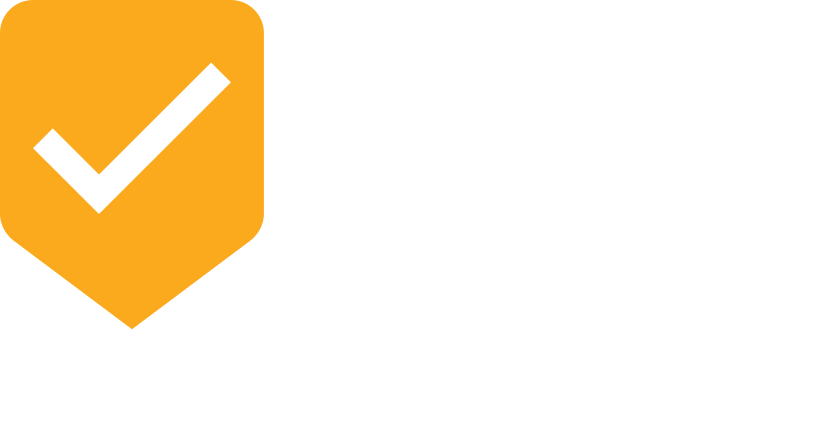

<p align="center">
  
</p>

<p align="center">
  <a href="https://www.nuget.org/packages/Dryv.AspNetCore"></a>
  <a href="https://github.com/mhusseini/dryv/blob/main/LICENSE"></a>
</p>

<p align="center">
  <strong>ASP.NET Core integration for Dryv — plugs DRY Validation into the MVC pipeline with Tag Helpers, dynamic controllers, and automatic server-side validation.</strong>
</p>

---

This package depends on the [`Dryv`](https://www.nuget.org/packages/Dryv) core library.

## Installation

```shell
dotnet add package Dryv.AspNetCore
```

## What's Included

- **MVC validation filter** — automatically validates models using Dryv rules and adds errors to `ModelState` (works alongside `[Required]`, `[StringLength]`, etc.).
- **Dynamic controller generation** — runtime-generated API endpoints for async validation rules that cannot run purely in the browser.
- **Tag Helper** — `<dryv-client-rules>` renders a `<script>` block with translated JavaScript validation functions.
- **HTML Helpers** — `@await Html.DryvValidation<TModel>()` for Razor views.
- **Preloading** — discover and compile all rules at startup for faster first requests.
- **`[DryvDisable]` attribute** — skip Dryv validation on specific controllers or actions.
- **Validation sets** — organize validation for multiple model types on a single page.
- **Built-in translators** — additional ASP.NET-specific translators for `IFormFile`, `IFormFileCollection`, and dynamic controller calls.

## Quick Start

### 1. Register Dryv

```csharp
var builder = WebApplication.CreateBuilder(args);

builder.Services
    .AddControllersWithViews()
    .AddDryv()                         // core Dryv services
    .AddDryvDynamicControllers()       // auto-generate endpoints for async rules
    .AddDryvPreloading();              // compile rules at startup

var app = builder.Build();

app.UseDryv();

app.MapDefaultControllerRoute();
app.Run();
```

### 2. Define Rules on Your Model

```csharp
using Dryv;

public class Address
{
    public static readonly DryvRules Rules = DryvRules
        .For<Address>()
        .Rule(
            a => a.City,
            a => string.IsNullOrWhiteSpace(a.City)
                ? "Please enter a city."
                : null)
        .Rule(
            a => a.ZipCode,
            a => a.ZipCode.Trim().Length < 5
                ? "ZIP code must have at least 5 characters."
                : null);

    public string City { get; set; }
    public string ZipCode { get; set; }
}
```

### 3. Render Client-Side Validation

**Tag Helper:**
```html
@addTagHelper *, Dryv.AspNetCore

<dryv-client-rules for="typeof(Address)" name="address" />
```

**HTML Helper:**
```html
@await Html.DryvValidation<Address>("address")
```

## Configuration

```csharp
builder.Services
    .AddControllersWithViews()
    .AddDryv(options =>
    {
        // Skip auto-adding the validation filter
        options.DisableAutomaticValidation = false;

        // Control behavior when translation fails
        options.TranslationErrorBehavior = TranslationErrorBehavior.Throw;

        // Register custom translators
        options.Translators.Add<MyCustomTranslator>();
    })
    .AddDryvDynamicControllers(options =>
    {
        // Customize endpoint routing
        options.WithEndpoint((ctx, routeBuilder) =>
            routeBuilder.MapControllerRoute(
                ctx.ControllerFullName,
                $"api/validate/{ctx.Action}"));

        // Add filters to generated controllers
        options.WithControllerFilters(ctx => new[] { ... });
        options.WithActionFilters(ctx => new[] { ... });
    });
```

## Deep Dive: Dynamic Controllers

When a C# rule cannot be translated to JavaScript (e.g., because it calls a database or an external API), Dryv automatically generates an ASP.NET MVC controller to execute it. The generated JavaScript calls this endpoint via AJAX.

### Securing Dynamic Controllers

Since dynamic controllers expose your validation logic to the web, you often want to secure them (e.g., requiring authentication). You can add MVC filters to the generated controllers:

```csharp
builder.Services.AddDryvDynamicControllers(options =>
{
    // Apply an [Authorize] attribute to all generated dynamic controllers
    options.WithControllerFilters(ctx => new[]
    {
        () => new AuthorizeAttribute()
    });

    // Or apply filters based on the context (e.g., the model type being validated)
    options.WithActionFilters(ctx =>
    {
        if (ctx.ControllerFullName.Contains("AdminModels"))
        {
            return new[] { () => new AuthorizeAttribute { Roles = "Admin" } };
        }
        return Array.Empty<Expression<Func<Attribute>>>();
    });
});
```

### Customizing the Endpoint Route

By default, dynamic controllers are routed to `_v/c{hash}`. You can customize this to fit your API structure:

```csharp
options.WithEndpoint((ctx, routeBuilder) =>
    routeBuilder.MapControllerRoute(
        ctx.ControllerFullName,
        $"api/validation/rules/{ctx.Action}"));
```

## Handling Results in API Controllers

If you are building an API instead of returning HTML views, the `DryvValidationFilterAttribute` will still run. If a validation error occurs, it is added to the `ModelState`.

You can also retrieve the Dryv-specific results directly from the `HttpContext`:

```csharp
[ApiController]
[Route("api/[controller]")]
public class UsersController : ControllerBase
{
    [HttpPost]
    public IActionResult CreateUser(UserModel model)
    {
        if (!ModelState.IsValid)
        {
            // You can extract the specific Dryv results if needed
            var dryvResults = HttpContext.GetDryvValidationResults();
            
            return BadRequest(new {
                Message = "Validation failed",
                DryvErrors = dryvResults
            });
        }
        
        return Ok();
    }
}
```

## Customizing JSON Serialization

Dryv passes parameters and validation results to the client. By default, it uses ASP.NET Core's built-in JSON serialization. You can override how Dryv serializes values (e.g., to camelCase or a specific date format):

```csharp
builder.Services.AddDryv(options =>
{
    options.JsonConversion = (value) => 
    {
        // Custom serialization logic
        return JsonSerializer.Serialize(value, new JsonSerializerOptions {
            PropertyNamingPolicy = JsonNamingPolicy.CamelCase
        });
    };
});
```

## Disabling Dryv per Action

```csharp
[DryvDisable]
public IActionResult Import(MyModel model)
{
    // Dryv validation is skipped
}
```

## Validation Sets

Use `[DryvSet("name")]` on model classes to organize validation into named sets, useful when a single page validates multiple model types.

### Single-Type Validation Set

```html
<!-- Renders a validation set named "address" with rules for Address -->
<dryv-client-rules for="typeof(Address)" name="address" />
```

### Multi-Type Validation Set (Dictionary)

When a page edits multiple models (e.g. billing + shipping addresses), pass a dictionary:

```html
<dryv-client-rules for="@(new Dictionary<string, Type> {
    { "billing", typeof(Address) },
    { "shipping", typeof(Address) }
})" />
```

Each entry produces a separate validation set with its own `name`, `validators`, `disablers`, and `parameters`.

### Tuple Shorthand

```html
<dryv-client-rules for="@((typeof(Address), "addr"))" />
```

### Using Model Instances

You can also pass a model instance (useful when you need the concrete instance for DI resolution):

```html
<dryv-client-rules for="Model" name="myModel" />
```

## Tag Helper — Advanced Usage

The `<dryv-client-rules>` Tag Helper supports several attributes:

| Attribute | Type | Description |
|-----------|------|-------------|
| `for` | `object` | Model type, tuple, dictionary of types, or model instance |
| `name` | `string` | JavaScript variable name for the generated validation set |

The Tag Helper renders a `<script>` block containing all translated validation functions and parameters for the specified models. The output looks like:

```html
<script>
var address = {
    name: "Address",
    validators: { /* ... */ },
    disablers: { /* ... */ },
    parameters: { /* ... */ }
};
</script>
```

## HTML Helper

The `Html.DryvValidation<T>()` extension method provides the same functionality as the Tag Helper:

```csharp
@await Html.DryvValidation<Address>("address")
// or with a validation set name:
@await Html.DryvValidation<Address>("address", "myValidationSet")
```

## Preloading

When you call `.AddDryvPreloading()`, Dryv scans all registered model types, discovers all rules, and compiles them at startup. This avoids cold-start latency on the first request.

```csharp
builder.Services
    .AddControllersWithViews()
    .AddDryv()
    .AddDryvDynamicControllers()
    .AddDryvPreloading(); // ← compile everything at startup
```

**Recommended for production.** Without preloading, the first request that triggers validation or client-side rule generation will be slower while Dryv discovers and compiles rules.

## Middleware Pipeline

`app.UseDryv()` registers the Dryv middleware, which:
1. Initializes dynamic controllers.
2. Sets up routing for the generated endpoints.

Always call it before `app.MapControllers()` / `app.MapDefaultControllerRoute()`:

```csharp
app.UseDryv();
app.MapDefaultControllerRoute();
app.Run();
```

## Client-Side Output Format

The Tag Helper / HTML Helper renders a `<script>` tag with a self-executing function that registers the rule set on `window.dryv.v`:

```html
<script>
(function(dryv) {
  if (!dryv.v) { dryv.v = {}; }
  dryv.v["address"] = {
    name: "address",
    validators: {
      "city": [{
        annotations: { "required": true },
        validate: function($m, $ctx) {
          return !/\S/.test($m.city || "")
            ? { type: "error", text: "Please enter a city.", group: null }
            : null
        }
      }],
      "zipCode": [{
        validate: function($m, $ctx) {
          return ($m.zipCode || "").trim().length < 5
            ? { type: "error", text: "ZIP code must have at least 5 characters.", group: null }
            : null
        }
      }, {
        async: true,
        validate: function($m, $ctx) {
          return $ctx.dryv.callServer('/_v/cab12ef34', 'POST', { "zipCode": $m.zipCode })
            .then(function($r) { return $ctx.dryv.handleResult($ctx, $m, "zipCode", null, $r); })
        }
      }]
    },
    disablers: {},
    parameters: {}
  }
})(window.dryv || (window.dryv = {}));
</script>
```

**Key points:**

- The IIFE `(function(dryv) { ... })(window.dryv || (window.dryv = {}))` ensures the global namespace exists.
- Rule sets are stored under `window.dryv.v["name"]`, making them globally discoverable.
- Multiple Tag Helpers on the same page each add their rule set to the shared `window.dryv.v` object.
- The output contains real JavaScript functions (not JSON), so it must be served as an inline `<script>`.

### Automatic Discovery by DryvJS / Dryvue

The `window.dryv.v` convention is exactly what the official client libraries expect. Pass the entire object to `DryvStaticRuleSets` and all rule sets are automatically available by name:

```typescript
import { createApp } from 'vue'
import { Dryv, DryvStaticRuleSets } from 'dryvue'

createApp(App)
  .use(Dryv)
  .use(DryvStaticRuleSets, window.dryv.v)  // registers all server-rendered rule sets
  .mount('#app')
```

Then reference by name in components:

```vue
<script setup lang="ts">
import { reactive } from 'vue'
import { useDryv } from 'dryvue'

const data = reactive({ city: '', zipCode: '' })
const { validatable, validate } = useDryv(data, 'address')
</script>
```

For vanilla JS/TS (without Vue):

```typescript
import { DryvValidationSession, DryvObjectValidator, defaultDryvOptions } from 'dryvjs'

const ruleSet = window.dryv.v['address']
const session = new DryvValidationSession(defaultDryvOptions, ruleSet)
const validator = new DryvObjectValidator(model, session, undefined, defaultDryvOptions)
const result = await validator.validate()
```

- **`$m`** — the model object (camelCase properties)
- **`$ctx`** — the validation context with `parameter(name)`, `dryv.callServer(url, method, data)`, `dryv.handleResult(...)`, `dryv.parseDate(...)`, `dryv.format(...)`

See the [Client-Side Usage](https://github.com/mhusseini/dryv#client-side-usage) section in the main documentation for detailed examples of consuming this output with React, Vue, Angular, and vanilla JavaScript.

## Tips for ASP.NET Core

### Use `TranslationErrorBehavior.Throw` in Development

```csharp
builder.Services.AddDryv(options =>
{
    if (builder.Environment.IsDevelopment())
        options.TranslationErrorBehavior = TranslationErrorBehavior.Throw;
});
```

This surfaces untranslatable rules immediately instead of silently falling back to server-only validation.

### CORS for Dynamic Controllers

If your frontend runs on a different origin (SPA scenario), ensure the dynamic controller endpoints are covered by your CORS policy:

```csharp
builder.Services.AddCors(options =>
{
    options.AddDefaultPolicy(policy =>
        policy.WithOrigins("https://my-spa.example.com")
              .AllowAnyHeader()
              .AllowAnyMethod());
});
```

### Combining with Data Annotations

Dryv works alongside standard data annotations (`[Required]`, `[StringLength]`, etc.). The MVC filter runs both and merges errors into `ModelState`. You don't need to choose one or the other.

### Disable Automatic Validation When Using a Custom Pipeline

If you have a custom validation pipeline (e.g. FluentValidation or MediatR behaviors), you can disable the automatic filter:

```csharp
builder.Services.AddDryv(options =>
{
    options.DisableAutomaticValidation = true;
});
```

You can still use `DryvValidator` manually in your pipeline.

## Documentation

See the [full documentation](https://github.com/mhusseini/dryv#readme) in the repository root for:
- Client-side usage with React, Vue, and Angular examples
- Build-time code generation patterns
- Standalone / custom integration (without ASP.NET Core)
- Comprehensive C# to JavaScript translation reference
- Rule discovery deep-dive (interfaces, base classes, nested models, collections)
- Troubleshooting and FAQ

## License

[MIT](../LICENSE)
